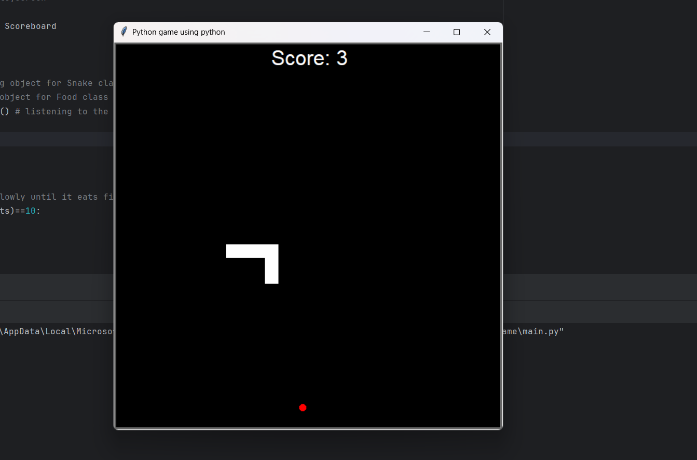
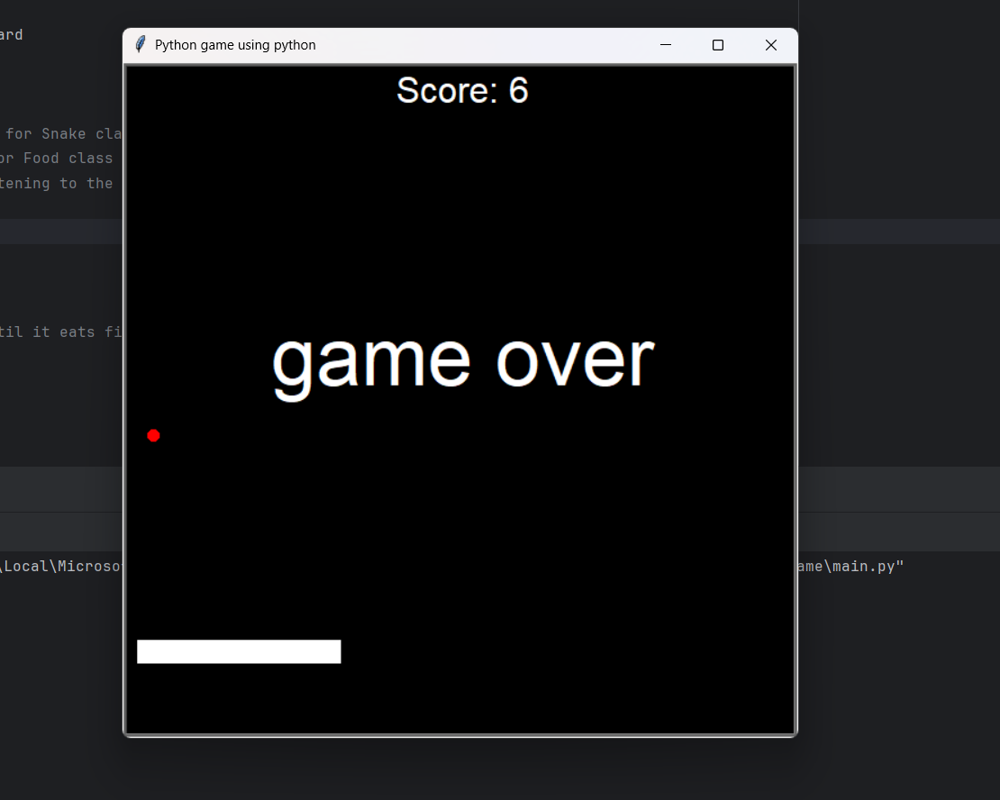

# 🐍 Classic Snake Game  

A fun and nostalgic **Snake Game** built with Python’s `turtle` library. Guide the snake to eat food, grow longer, and challenge yourself to achieve the highest score without hitting the walls or yourself.  

---

## ✨ Features  
- Smooth snake movement controlled by arrow keys  
- Random food spawning and growth mechanics  
- Dynamic scoreboard that updates in real time  
- Simple modular structure for easy customization  
- Lightweight — only requires Python’s built-in `turtle` module  

---

## 📂 Project Structure 
```
📁 Snake-Game
│── main.py # Entry point of the game
│── snake.py # Snake creation & movement logic
│── food.py # Food utilities & spawning system
│── score_board.py # Score management & display
```

---

## 🚀 Getting Started  

### 1️⃣ Clone the repository  
```
git clone https://github.com/Thamaraiselvan10/snake-game-classic.git
cd snake-game
```
### 2️⃣ Run the game

Make sure you have Python 3.x installed. Then run:
```
python main.py

```
## 🎮 Controls

- ⬆️ **Up Arrow** – Move Up  
- ⬇️ **Down Arrow** – Move Down  
- ⬅️ **Left Arrow** – Move Left  
- ➡️ **Right Arrow** – Move Right  

---


## 🛠️ Technologies Used

- **Python 3**  
- **turtle** (standard library)  

---

## 📸 Preview


---



---

## 💡 Future Improvements

- Add difficulty levels  
- Implement sound effects  
- Add pause/restart functionality  
- Multiplayer snake mode  

---

## 🤝 Contributing

Contributions, issues, and feature requests are welcome!  
Feel free to fork this repo and submit a pull request.  

# 📜 License

This project is licensed under the MIT License – feel free to use and modify.
